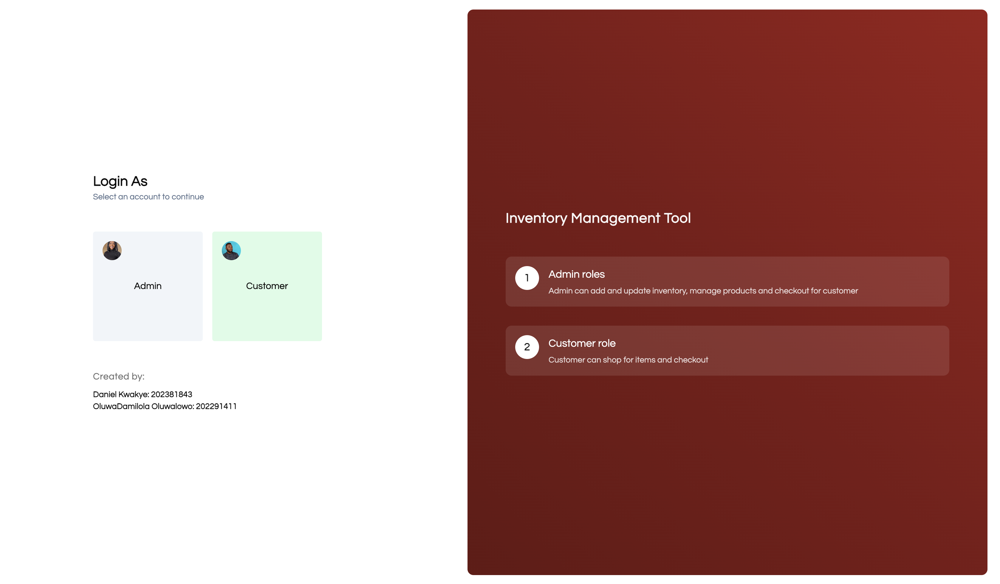
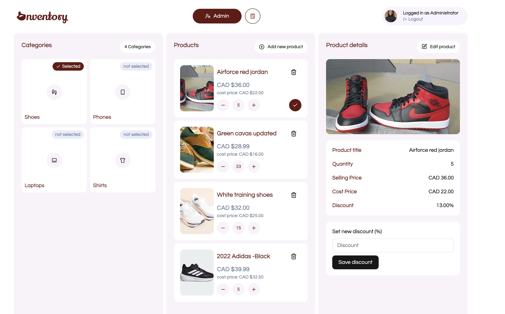
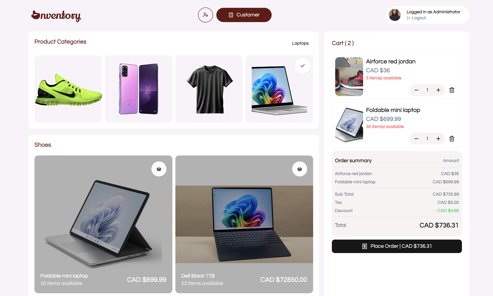

# 🧾 Inventory Management System – React Frontend

This is the frontend for an **Inventory Management System**, developed using **React**, **Vite**, and **TypeScript**. It provides a modern, responsive interface for administrators to manage products, update inventory, and process checkouts. The frontend integrates tightly with a FastAPI backend, using RESTful APIs to perform real-time inventory operations.

## Screenshots




## 📌 Project Purpose

The goal of this project is to provide a clean and functional interface for inventory control, allowing administrative users to:

- View product listings filtered by category
- Add, edit, or delete products
- Upload product images
- Manage product stock levels
- Perform checkout transactions for multiple items

---

## ⚙️ Tech Stack

- **Framework:** React + Vite
- **Language:** TypeScript
- **Styling:** Tailwind CSS
- **HTTP Client:** Axios
- **Form Handling:** React Hook Form (or alternative)
- **Testing:** (Optional — Jest, React Testing Library)

---

## 🚀 Running the Project Locally

### Prerequisites

- Node.js (v18 or higher)
- npm or yarn

### Installation

```bash
git clone https://github.com/your-username/inventory-frontend.git
cd inventory-frontend
npm install